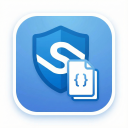

# Sentinel Smart Copy 🛡️

  

**Streamline your Detection Engineering workflow.**

Sentinel Smart Copy is a lightweight browser extension that adds a dedicated **"Copy KQL"** button to the Microsoft XDR Content Hub interface. It solves the friction of selecting and copying raw query code from small preview blades, ensuring you get clean, formatted KQL every time.

## 🚀 Features

* **One-Click Extraction:** Instantly copies KQL rules from the "Rule query" preview pane.
* **Smart Formatting:** Automatically preserves newlines and indentation while stripping accidental UI artifacts.
* **Multi-Portal Support:** Works seamlessly on `security.microsoft.com` (Microsoft Defender XDR)
* **IFrame Compatible:** Intelligent DOM observation works even within nested Azure blades.
* **Visual Feedback:** Instant "Copied!" state confirmation.

## 📦 Installation

### Official Stores (Coming Soon)
* Microsoft Edge Add-ons: *[Pending Review]*
* Chrome Web Store: *[Pending Review]*

### Manual Installation (Developer Mode)
Until the store review is complete, you can "sideload" the extension:

1. **Clone or Download** this repository to your local machine.
2. Open your browser's extensions page:
    * **Edge:** `edge://extensions`
    * **Chrome:** `chrome://extensions`
3. Enable **Developer mode** (Toggle switch usually in the top right corner).
4. Click the **Load unpacked** button.
5. Select the folder containing the `manifest.json` file.
6. Navigate to the [Security Portal](https://security.microsoft.com), open Content Hub, and click on a rule!

## 🔒 Privacy & Security

As security professionals, we trust but verify.
* **Local Execution:** This extension runs entirely in your browser.
* **No Data Collection:** No telemetry, analytics, or user data is collected or transmitted.
* **Minimal Permissions:** Requires `clipboardWrite` solely for the copy function. `activeTab` is used to inject the button only on Microsoft security domains.

## 🛠️ How it Works
The extension uses a `MutationObserver` to watch the DOM for the specific KQL viewer containers used by the Azure/Monaco editors. When a valid "Rule query" container is detected (using stable `data-testid` selectors), it injects a floating button into the DOM relative to that specific code block.

## 🤝 Contributing
Pull requests are welcome. For major changes, please open an issue first to discuss what you would like to change.

## 📝 License
[MIT](LICENSE)
